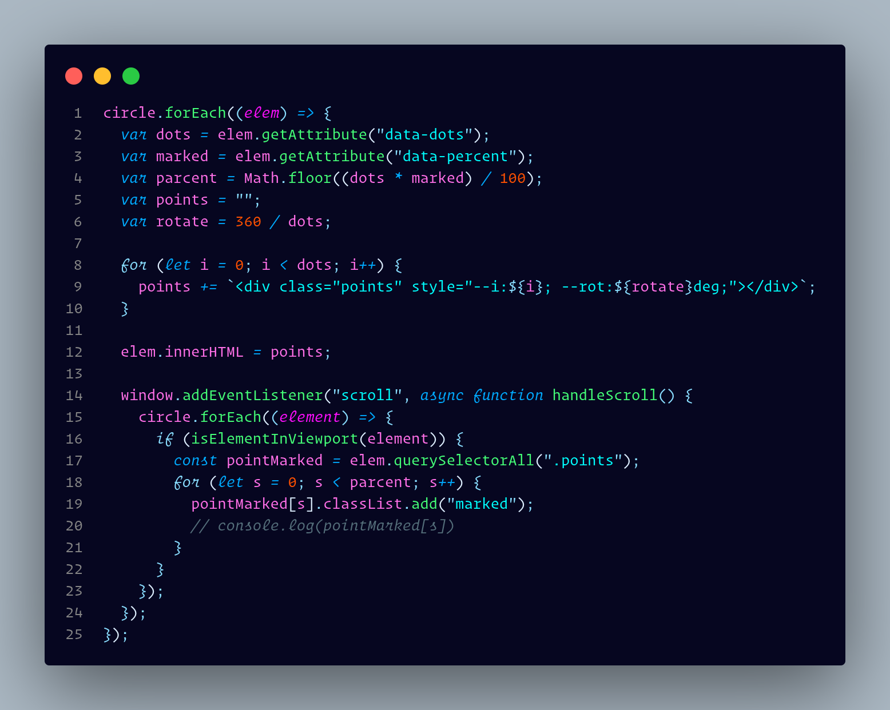

<div align="center">

# VSCode Mathab Theme

<a href="https://www.buymeacoffee.com/mrsihab"></a>
</div>

### Installation

> Try any of these one bellow

Open VSCode and press `ctrl`+`p` then paste it and hit `Enter`:

```code
ext install eigfa.mathab-theme
```

[VSIX method](#for-codium-users)

<!-- [](https://marketplace.visualstudio.com/items/eigfa.mathab-theme) -->

### About Mathab

Mathab Theme is a VScode / Codium theme I specially designed for myself.  
I was searching a well desinged and Coding friendly theme. But I didn't find a suitable one. Some
may looks good with my JavaScript codes, But not looks good with my flutter codes. And the
most important issue was that Working in existing code was so much painfull. Even I put a lot of comments it
become hard to identify codes.  
Another problem was that I like some keywords to be italic. But not every theme provide that exept Material Theme.  
So I thought to change the settings.json file. But later I thought about making and extension. So I created
One for me. Then I made it available in marketplace so that everyone can use it.

The name **Mathab** is from **Mat**erial Keyword and my name Si**hab**. I made it comportable
for Good looking and easy code catching based on their usecases and priority. For example I made css
identifiers(Class, Id, Tag) more highlighted than css properties. A developer will try to find css
identifiers. But the property inside it don't need to be highlighted.

### Here's some preview of the Extension.

_Javascript_


_TypeScript_


_Dart/Flutter_


_JSON_


_HTML_


_CSS_


## Codium

Mathab is available on [OpenVSX](https://open-vsx.org/extension/EIGFA/mathab-theme).  
That means you can easily install it from codium too.
For VSIX file, refer to the [OpenVSX](https://open-vsx.org/extension/EIGFA/mathab-theme) page and download the VSIX file there.

<div align="center">

#  Buy me a coffee

Your happiness and support make these projects. If you really like this project and you got it helpfull,  
___Can I have a cup of coffee___


  
</div>


